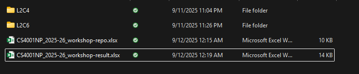
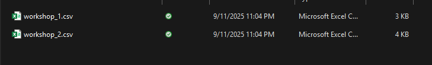
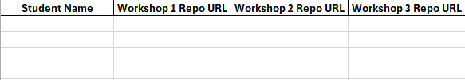
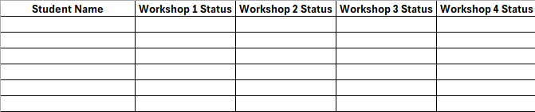
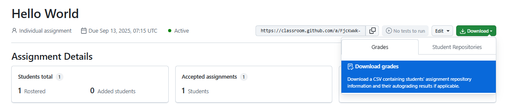

# Java Workshop Grader

This script automates the process of grading Java workshop projects from Informatics College Pokhara by cloning student repositories, compiling the code, and running predefined test cases. It sets status of workshops as: `Completed`, `Partial Complete`, `Incomplete`, and `Absent`.

## Configuration

Before running the script, you need to set up your environment.

### 1. Dependencies

Install the required Python packages:

```bash
pip install pandas openpyxl python-dotenv
```
### 2. Environment Variables

Create a `.env` file in the root of the project directory and add the following variables:

```
STUDENT_SUBMISSIONS="path/to/your/submissions.xlsx"
STUDENT_RESULTS="path/to/your/results.xlsx"
CLASSROOM_DIR="path/to/your/classroom_exports"
```

-   `STUDENT_SUBMISSIONS`: The absolute path to the Excel file containing student submission details. This file should have sheets for each section that you teach (e.g., `L2C1`, `L2C2`). 
-   `STUDENT_RESULTS`: The absolute path to the Excel file where the grading results will be stored. This will also have the sheets same as the `STUDENT_SUBMISSIONS`.
-   `CLASSROOM_DIR`: The directory where GitHub Classroom assignment CSVs are stored. The script expects a structure like `CLASSROOM_DIR/L2C1/workshop_1.csv`.

### 3. System Requirements

Ensure you have the following installed and available in your system's PATH:
-   Git
-   Java Development Kit (JDK) (for `javac` and `java`)

### 4. Workshop Inputs

The `workshop_inputs.json` file contains the test cases for each workshop. Each workshop is an object with a `task` description and a list of `tests`. Each test has an `input` to be provided to the program and an `expected` output.

```json
{
  "1": {
    "task": "Hello World",
    "tests": [
      { "input": "", "expected": "Hello World" }
    ]
  }
}
```
### 5. Working Directory Setup

1.  **Main Directory** 

    

2.  **Classroom Submissions** 

    

3. **Workshop-repo.xlsx format**

    

4. **Workshop-result.xlsx format**

    

    Follow the following column structure with sections sheets as the format: `L2C1`, `L2C2` sections that you teach for both repo and result excel files.
5. **Submissions from Classrooms**
    - Download and rename the file as workshop_X.csv and put it in the section folder of the working directory.

    
    
    ```
        The script will:
        - Read the corresponding workshop_X.csv files from each section.
        - Match students by name.
        - Insert/update their repo URLs in the Submissions sheet.
        - Keep previous workshop submissions intact.
    ```
## How to Use

1.  **Run the script** from your terminal:
    ```bash
    python grade_java_projects.py
    ```

2.  **Enter the section number** when prompted. This corresponds to the sheet name in your Excel files (e.g., for sheet `L2C5`, enter `5`).

3.  **Enter the workshop number** (e.g., `1`, `2`, etc.). The script will use the corresponding test cases from `workshop_inputs.json`.

    ```
        The script will then:
        -   Optionally update the submissions sheet with the latest GitHub Classroom CSV.
        -   Clone each student's repository.
        -   Compile the Java code.
        -   Run the defined test cases.
        -   Write the results to the specified results Excel file, updating the relevant columns for the workshop.
        -   Add a dropdown for status selection and format the results sheet as provided by the college administration.
    ```
## For Maintainers

-   The script is designed to be modular. The core logic for processing repositories is in `process_student_repo`, and test execution is in `run_tests`.
-   The `update_master_with_classroom` function handles the integration with GitHub Classroom exports. It merges the repo URLs from the CSV into the main submissions sheet.
-   When adding new workshops, simply add a new entry in `workshop_inputs.json` with the workshop number as the key.
-   The script handles projects with multiple `main` classes by detecting them and would need to be modified to prompt the user for which one to use. Currently, it uses the first one it finds.
-   Error handling is included for common issues like failed clones, compilation errors, and timeouts.
-   The Excel writing logic is designed to update existing sheets without overwriting other data, by merging on `Student Name`. 

## GitHub Classroom for Assignments

Check out: [Guides for GitHub Education](https://docs.github.com/en/education/guides).

Check out: [Create an individual assignment](https://docs.github.com/en/education/manage-coursework-with-github-classroom/teach-with-github-classroom/create-an-individual-assignment).


### Note: `Ensure student names are consistent across files.`
